  

    

  
  
  

    

  

    

  <table>
    <tr>
      <td align="center" width="90">
         PYTHON
      </td>
      <td align="center" width="90">
         TS
      </td>
      <td align="center" width="90">
         REACT
      </td>
      <td align="center" width="90">
         NEXT
      </td>
      <td align="center" width="90">
         LINUX
      </td>
      <td align="center" width="90">
         GIT
      </td>
    </tr>
  </table>

